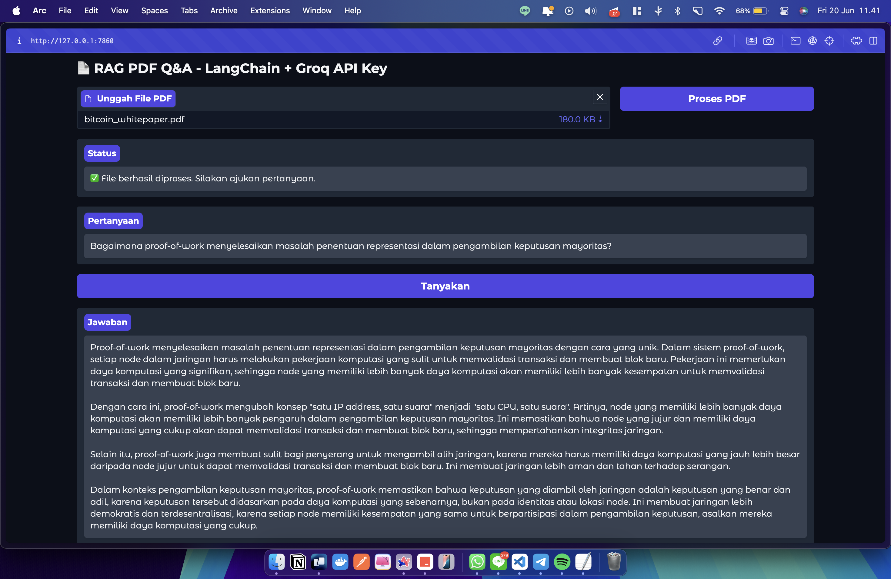
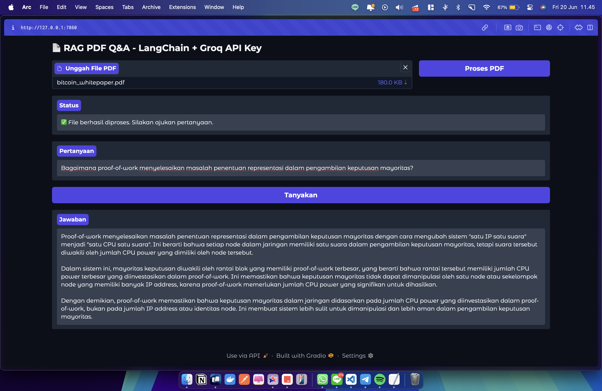
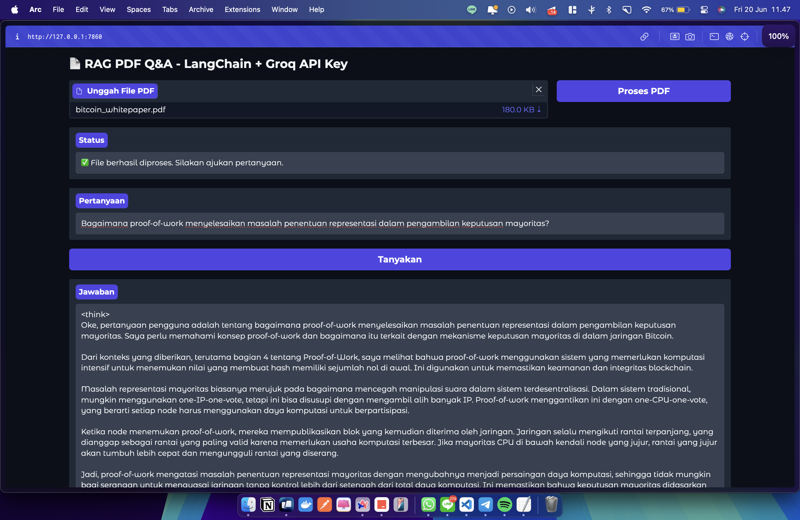
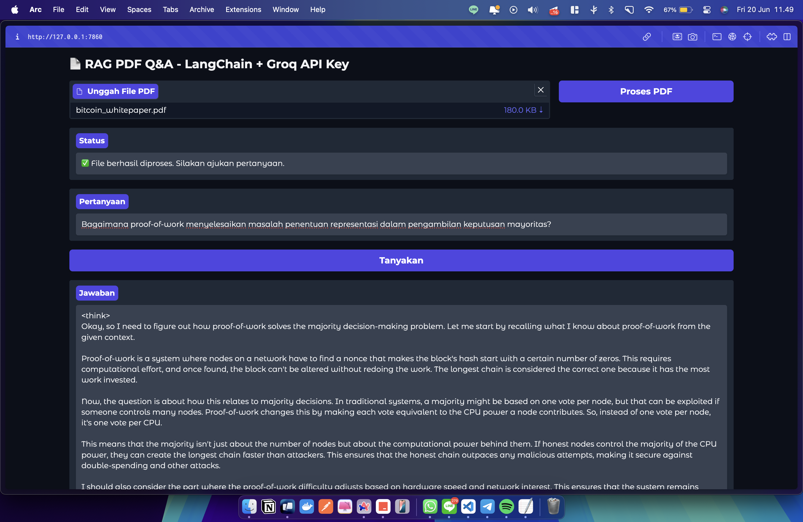
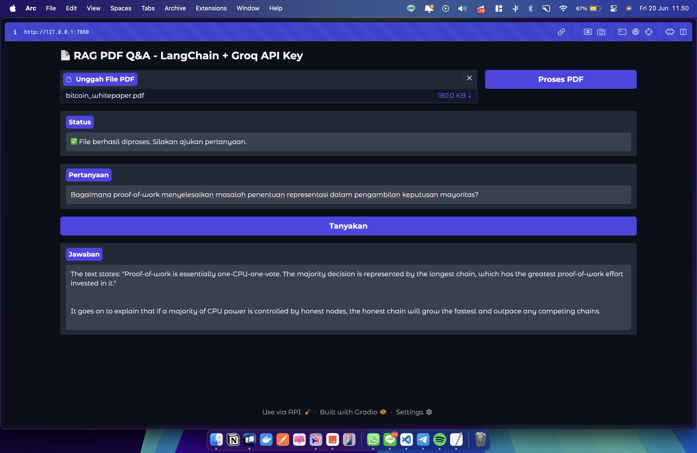
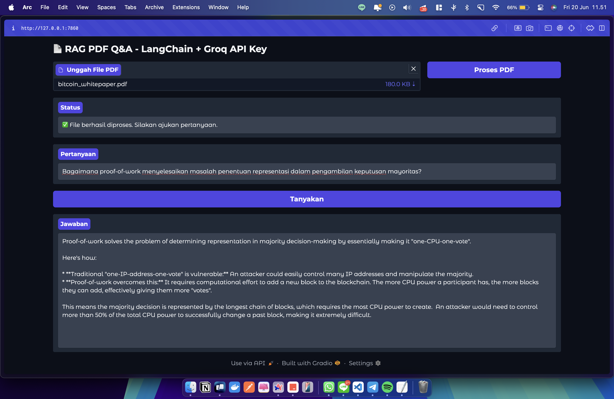

<h1 align="center"> Retrieval-Augmented Generation with Gradio and Groq API Key</h1>
<p align="center"> Natural Language Processing Project</p>

<div align="center">


</div>

### Name : Martin Marcelino Tarigan
### Tech Stack : Python, Gradio, LangChain, HuggingFace Embedding, FAISS vector store

---

### 1. Analysis about how the project works
- This project creates a Retrieval-Augmented Generation (RAG) system. It uses LangChain to connect large language models (LLMs) from the Groq API (like LLaMA and DeepSeek) with a FAISS vector database. HuggingFace Embeddings transform uploaded PDF content into searchable vectors. When a user asks a question, the system retrieves the most relevant PDF sections, which are then used by the LLM to generate an answer. A Gradio interface provides simple user interaction.

### 2. Analysis about how different every model works on Retrieval-Augmented Generation

```python
def get_llm():
    return ChatGroq(
        groq_api_key=GROQ_API_KEY,
        model_name="llama-3.3-70b-versatile", # Change the model in the code
        temperature=0.2
    )
```
- Model used : ```[llama-3.3-70b-versatile, deepseek-r1-distill-llama-70b, gemma2-9b-it]```

2.1 Analysis on ```llama-3.3-70b-versatile``` : 
- Temperature = 0.2

    

- Temperature = 0.8

    

- Analysis

    Terlihat bahwa pada temperatur 0.2 (gambar 1), jawaban yang dihasilkan cenderung lebih konsisten, terstruktur, dan fokus pada informasi utama dari dokumen PDF, mencerminkan pendekatan yang lebih deterministik. Sebaliknya, pada temperatur 0.8 (gambar 2), jawaban menunjukkan variasi yang lebih besar, dengan gaya bahasa yang lebih kreatif dan sedikit melenceng dari konteks utama, menandakan peningkatan keacakan yang memungkinkan interpretasi yang lebih beragam namun kurang presisi. Perbedaan ini menyoroti bagaimana temperatur memengaruhi keseimbangan antara ketepatan dan kreativitas dalam respons model.

2.2 Analysis on ```deepseek-r1-distill-llama-70b``` : 
- Temperature = 0.2

    

- Temperature = 0.8

    

- Analysis

    Pada temperatur 0.2 (gambar 1), jawaban menunjukkan struktur yang lebih terorganisir dan konsisten dengan konteks dokumen PDF, dengan fokus pada mekanisme proof-of-work dan representasi mayoritas, meskipun tetap singkat dan langsung. Sebaliknya, pada temperatur 0.8 (gambar 2), jawaban menjadi lebih ekspansif dan sedikit lebih spekulatif, dengan tambahan pertimbangan seperti penyesuaian berdasarkan kecepatan hardware dan integritas jaringan, menunjukkan peningkatan kreativitas namun dengan risiko penyimpangan dari informasi utama. Perbedaan ini menggambarkan bagaimana temperatur yang lebih tinggi mendorong variasi respons, sedangkan yang lebih rendah menjaga ketepatan.


2.3 Analysis on ```gemma2-9b-it``` : 
- Temperature = 0.2

    

- Temperature = 0.8

    

- Analysis

    Pada temperatur 0.2 (gambar 1), jawaban disajikan secara singkat dan langsung, fokus pada konsep dasar proof-of-work sebagai "one-CPU-one-vote" dengan penjelasan singkat tentang representasi mayoritas melalui rantai terpanjang, menunjukkan ketepatan tinggi. Sebaliknya, pada temperatur 0.8 (gambar 2), jawaban menjadi lebih rinci dan ekspansif, menambahkan penjelasan tentang kelemahan "one-IP-address-one-vote" serta mekanisme perlindungan terhadap manipulasi dengan memerlukan lebih dari 50% kekuatan CPU, meskipun ada sedikit risiko penyimpangan dari poin utama. Perbedaan ini menunjukkan bahwa temperatur rendah menghasilkan respons yang lebih terfokus, sementara temperatur tinggi meningkatkan kedalaman namun dengan variasi yang lebih besar.


### 3. Analysis about how temperature works

```python
def get_llm():
    return ChatGroq(
        groq_api_key=GROQ_API_KEY,
        model_name="llama-3.3-70b-versatile",
        temperature=0.2 # Change the temperature value here and analzye
    )
```

3.1 Analysis on higher temperature 
- Temperatur tinggi (0.8) pada ketiga model menghasilkan jawaban yang lebih kreatif, ekspansif, dan bervariasi, sering kali menambahkan detail tambahan seperti kelemahan sistem tradisional atau pertimbangan teknis lanjutan terkait proof-of-work.

3.2 Analysis on lower temperature
- Temperatur rendah (0.2) pada ketiga model (llama-3.3-70b-versatile, deepseek-r1-distill-llama-70b, dan gemma2-9b-it) menghasilkan jawaban yang sangat konsisten, terstruktur, dan berfokus pada informasi inti dari dokumen PDF, seperti mekanisme proof-of-work dan representasi mayoritas. Respons ini cenderung langsung dan presisi, dengan sedikit variasi, yang menjadikannya ideal untuk situasi di mana akurasi dan kejelasan adalah prioritas utama. 

### 4. How to run the project

- Clone this repository with : 

```git
git clone https://github.com/arifian853/RAG_with_GroqAPI.git
```

- Copy the ```.env.example``` file and rename it to ```.env```

```
GROQ_API_KEY=your-groq-api-key
```

- Fill the ```GROQ_API_KEY``` with your Groq API Key, find it here : https://console.groq.com/keys


- Create and activate Virtual Environment

    Open your terminal in the project directory and run the following command to create a virtual environment:

```bash
python -m venv venv
```


Next, activate the virtual environment.
Windows:

```bash
venv\Scripts\activate
```

macOS & Linux:

```bash
source venv/bin/activate
```


- Install Dependencies
```bash
pip install -r requirements.txt
```

- Run the App.
```bash
python3 app.py
```

- Modify model and temperature.
 If you wish to experiment with different language models or adjust the creativity of responses, open the app.py file. There, you can change the model_name (e.g., to "deepseek-r1-distill-llama-70b") and temperature (e.g., 0.8).
```python
model_name="deepseek-r1-distill-llama-70b",
temperature=0.8
```

- Try various combinations of models and temperature values to observe how they affect the output quality of the system.

- Push to GitHub
To save your work, set the Git remote URL to your GitHub repository (git remote set-url origin https://github.com/<YourRepo>/RAG_with_GroqAPI.git), add all files (git add .), commit your changes with a message (git commit -m "RAG with Groq"), and push to the main branch (git push origin main).
```bash
git remote set-url origin https://github.com/<YourRepo>/RAG_with_GroqAPI.git
git add .
git commit -m "RAG with Groq"
git push origin main
```